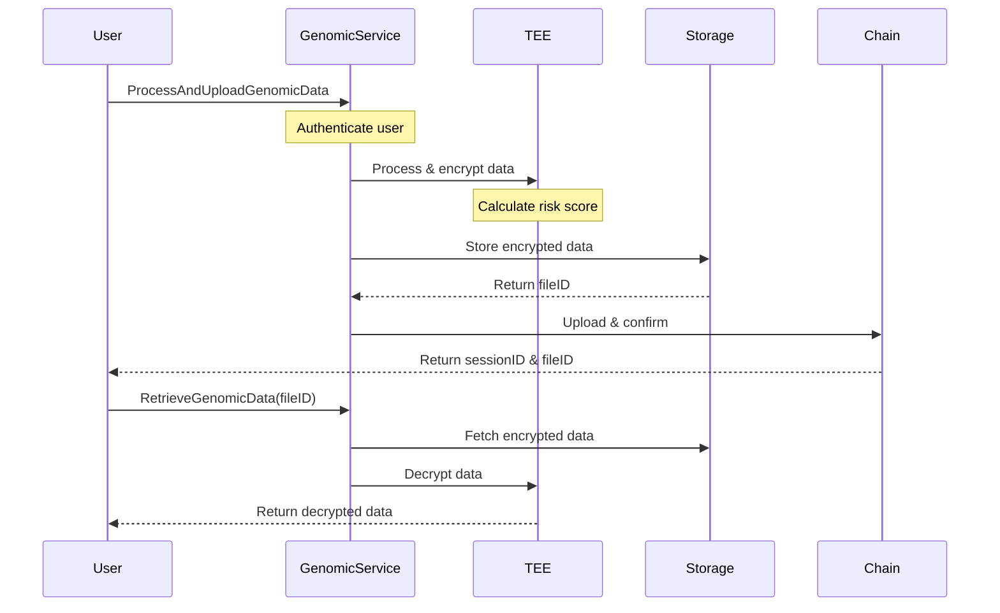

## GenomicDAO Implementation

### Overview


+ Complete all smart contracts `TODOs` and pass tests.
+ Setup LifeNetwork L1 Subnet-EVM and deploy GenomicDAO.
+ Backend service served as gateway for user interactions
+ Comprehensive comments and Swagger for the RESTful API.
### Submissions

#### Setting up the subnet

First, run the `create` command and enter the neccessary information(chainID, token symbol, subnet type)
```
avalanche blockchain create lifeNetwork
```

Then, deploy the subnet. In this case I deploy to localnet. More information [here](https://docs.avax.network/avalanche-l1s/build-first-avalanche-l1)

```
avalanche blockchain deploy lifeNetwork
```
