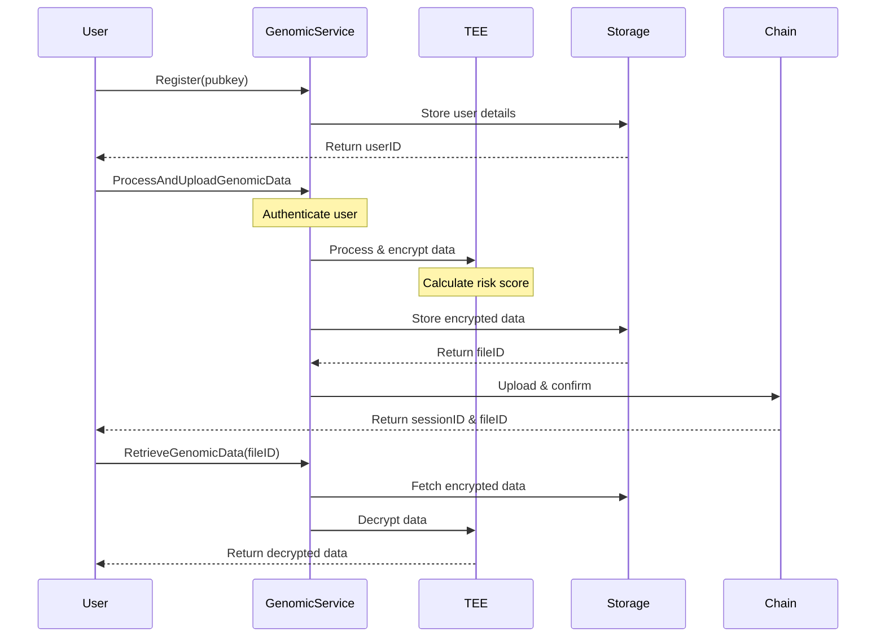

## GenomicDAO Implementation

### Overview


### Details

#### Techstack

+ API: Gin framework
+ Database: SQLite
+ Blockchain: Avalanche L1(Subnet-EVM)

#### Setting up the subnet

First, run the `create` command and enter the neccessary information(chainID, token symbol, subnet type)
```
avalanche blockchain create lifeNetwork
```

Then, deploy the subnet. In this case I deploy to localnet. More information [here](https://docs.avax.network/avalanche-l1s/build-first-avalanche-l1)

```
avalanche blockchain deploy lifeNetwork
```

#### Swagger docs
```bash
./scripts/gen-swagger.sh
```

The swagger will be available at localhost:8080/swagger/index.html
#### Tests

+ Complete user flow: ./server/server_test.go

##### Result

```
Confirmed upload with tx hash: 0x7a1fbd9545438f330e6b75c10d70b92f312d3348cfa3dd776f931d66fa5d208d
Minted GeneNFT with token ID: 12
Rewarded PCSP with amount 30000000000000000000 to 0x62f563A2e09c7987dECBFF61fdcC89cd74717721
[GIN] 2024/12/15 - 16:33:01 | 200 |  2.066610958s |             ::1 | POST     "/upload"
Raw response body: {"sessionId":"12","message":"Genomic data uploaded successfully","fileId":"e4aff07bdd9ec5be"}
[GIN] 2024/12/15 - 16:33:01 | 200 |    3.336542ms |             ::1 | GET      "/retrieve?fileID=e4aff07bdd9ec5be"
[GIN] 2024/12/15 - 16:33:01 | 200 |    2.574792ms |             ::1 | GET      "/pcsp/balance?address=0x62f563A2e09c7987dECBFF61fdcC89cd74717721"
PCSP balance: 30000000000000000000
```

